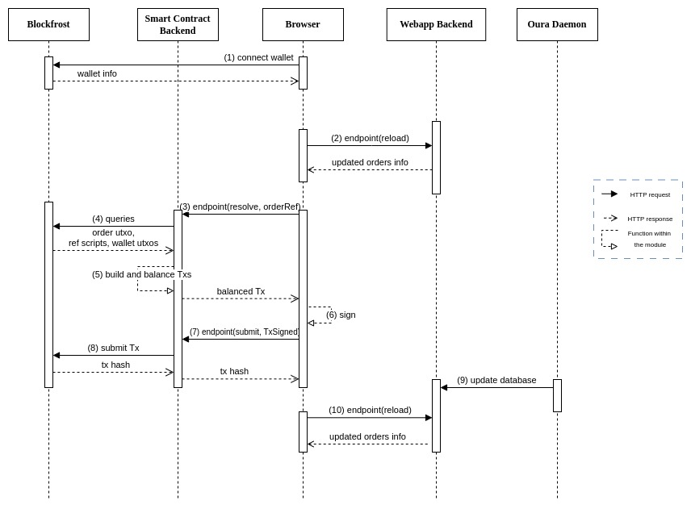

# Architecture Overview

## Cardano dApp Architecture

For the implementation of the Order dApp we propose a Client-Server architecture[^5]. The unique component of the Client side is the Browser, which runs the dApp frontend code (this is the interface with the user), and signs transactions. We are able to connect to any CIP-30 wallet through the Lucid-Cardano framework [^1].

On the server side, there are four services: Smart contract backend, Webapp backend, Oura[^2] and Blockfrost[^3] (the latter two are external services). The smart contract backend is the off-chain code responsible for building, balancing and submitting transactions. It connects to the browser via a rest API.
 The webapp backend is the orders database, responsible for keeping information about every order. It is responsible for sending the updated orders to the browser for display to the user. Oura is a tool to *observe* the blockchain and react to particular events, we use it to upate the database. Blockfrost is an API used to query the blockchain and submit transactions to it.

The on-chain part of our dApp consists of a validator and a minting policy. A more in-depth explanation of the blockchain side of the implementation can be found in the [Design file](./design.md).

The following diagram shows the flow of performing a Resolve operation (though it is similar for Start and Cancel):

We connect our wallet from the browser (1). By pressing the reload button, our tables get populated with all the orders information available in the database (2). Then if we choose, for example, to resolve an order, the chosen operation is passed to the smart contract backend with all the necessary information (in this case, the order UTxO reference) (3). Then some additional queries are made to Blockfrost (4): in this case, we need the order UTxO, the reference scripts for validation, and our wallet UTxOs so the transaction can be built and balanced in (5). This balanced transaction is then sent back to the front, where it is signed (6) and sent via the submit endpoint again to the smart contract backend, so it can be finally submitted. The last two solid arrows of the diagram show how the backend database is updated with the information provided by the oura daemon (9), but in order for the user to see the updated info she needs to press the reload button (10).

## 1. Client Side

### 1.1 Webapp Frontend

The client side is the browser running the frontend code. This is the user's interface with the dApp.
It establishes connections with both the smart contract backend and the webapp backend database via distinct endpoints. Most of the UI of our browser were implemented using Chakra [^8] components.
In order to connect to a wallet we use use-cardano[^7]. This library provides a set of React hooks that allow us to connect to a wallet in a simple way.
The frontend allows the user to interact with the current orders, that is, to be able to solve those that are of interest to them. Also, the user can create new orders and cancel them in case they have not been resolved.
It also has a history page, where the user can see the operations performed on their orders.

## 2. Server Side

### 2.1 Smart contract Backend

The smart contract backend in charge of the off-chain part of the dApp, that is, building transactions related to the operations of the dApp (Start, Cancel, Resolve), balancing and submitting them. It connects to the blockchain through the Lucid-Cardano framework, and it is also used to query the blockchain for the UTxOs that are needed to build the transactions, using Blockfrost as a provider (it could be replaced by any other provider). The smart contract backend also exposes endpoints to the webapp, allowing the communication between them.
The endpoints serve two functions within the dApp's operation:

- **Order operation endpoints (Start, Cancel, Resolve):** receives the operation's parameters and builds a (balanced but not signed) transaction.
- **Submit:** receives a signed transaction and submits it to the blockchain.

The endpoints used to connect with the frontend were implemented using the Express[^4] framework.

### 2.2 Webapp Backend

The webapp backend is a relational database made with Prisma ORM[^6]. Information about active orders as well as "finished" (either canceled or resolved) ones, is present in this database. The data about active orders is used to populate the frontend showing the user what orders to cancel/resolve. And the data about finished orders is used to populate the **History** page.
The **Reload** endpoint makes a query to this database to retrieve the orders information.
The **UpdateOrder** endpoint takes information about select transactions and updates the database with this information. It is called when an order is created, cancelled or resolved, from the Oura daemon.

### 2.3 External Services

#### 2.3.1 Oura

We use Oura in its daemon mode, so a process is continuously "observing" the blockchain and filtering events. In our case, the events of interest are the transactions where an order is either created or consumed. The following is the configuration we are using:

- **Source stage:** we use a Node-to-Node (N2N) connection to a remote preprod cardano node.
- **Filter stage:** our main filter is a deno filter that collects all the transactions of interest and sends the necessary information as two lists (one containing the info of txs creating an order and another the info of txs consuming one) to the sink. It does so by checking if the control token (explained in the design document) is minted or burnt.
- **Sink stage:** we use a WebHook sink. It is responsible for receiving the lists of transactions and submitting this payload to a webhook via an endpoint call to the webapp backend (database).

Thanks to the information received into the sink, we can update the backend database with the orders that have been created or consumed, without any additional Blockfrost query.

#### 2.3.2 Blockfrost

Blockfrost is an API for accessing and processing information from the Cardano blockchain. It provides abstraction between the user and the blockchain data, taking away the burden of complexity. In this case, Blockfrost is used to get the current tip of the blockchain and it is used as a service provider for Lucid-Cardano (services include querying the blockchain and submiting transactions to it).

[^1]: <https://lucid.spacebudz.io/>
[^2]: <https://oura.txpipe.io/>
[^3]: <https://blockfrost.io/>
[^4]: <https://expressjs.com/es/>
[^5]: <https://en.wikipedia.org/wiki/Client%E2%80%93server_model>
[^6]: <https://www.prisma.io/>
[^7]: <https://github.com/use-cardano/use-cardano>
[^8]: <https://chakra-ui.com/>
