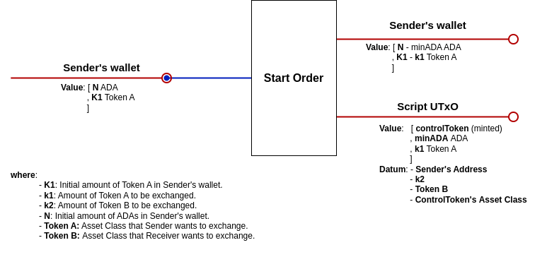
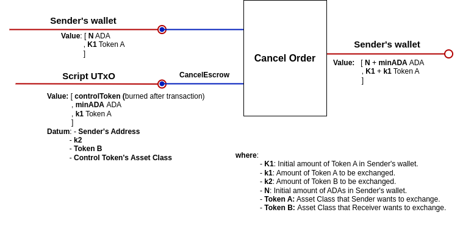
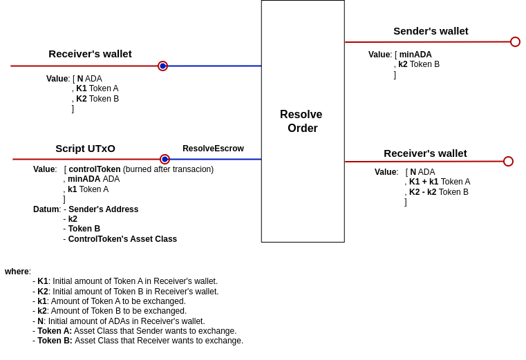

# Order book App Design

## dApp Overview

The Simple Order Book dApp will be implemented in the Cardano blockchain using Plutus Scripts.

Each time a user starts an order, a new script UTxO is created. This UTxO contains, in its datum, information specific to that instance: payment details along with the sender addresses. To ensure the initial conditions of the orders, a special control Token is minted at the start.
This strategy follows the ideas described in [this article](https://well-typed.com/blog/2022/08/plutus-initial-conditions/)
from Well-Typed, where the minted NFT is called the *state token*.

The script is the same for every order available. Anyone can see all the orders that were opened by other users and resolve them, or cancel their own.
The *control Token* Minting Policy remains constant for every order, and the asset class must be included in the datum for subsequent validations on cancel or resolve operations.

When an order is canceled or resolved, the corresponding UTxO is spent, and funds go to the corresponding wallet addresses. The control Token is then burned.

### Script UTxO

#### Datum

- Sender’s address
- The amount and asset class of the receiver’s payment
- Asset Class of the Control Token

#### Value

- Control Token
- The sender’s tokens to exchange
- min-ADA

### Transactions

#### Reference Scripts

In some dApps, all of the on-chain scripts for validation and minting have to be included in the transaction itself. This isn't the case in our implementation because we are using reference scripts[^5]. This means that the validation scripts are attached to an unspent transaction output, in the special **reference script** field. This UTxO is on the blockchain and we can read the scripts held in it by referencing it with the corresponding hash and index. This implementation reduces the size of the transactions that run a script.

#### Start

In this transaction, a user locks the tokens they want to exchange and specifies the tokens they want to receive. The control Token is then minted.

#### Cancel

The user can cancel the order and receive the locked tokens back. The control Token is then burned.

#### Resolve

The other user pays `k2` Token `B`, closing the script and burning the control token. Each user gets the corresponding tokens.

An **important clarification** for the transactions is what happen when one of the token A or token B is ADA. Considering that the smallest unit of **ADA** is **Lovelace**, the Wallet funds or the Script locked value change in the following way:

Every time we have **N** **ADAs** and **k1** **Token A** and A is **Lovelace**, then the total amount of **ADAs** will be **(N * 1_000_000) + k1 Lovelace**

### Validator Scripts

#### Script Validator

Validates the transactions that involve spending the **script UTxO**: Cancel and Resolve.

In the **Cancel operation**, the validator ensures:

- The address that is trying to cancel the order is the same as the Sender’s address.
- The control token is burned after the transaction.

In the **Resolve operation**, the validator ensures:

- The sender’s address receives the tokens specified in the datum.
- The control token is burned after the transaction.

#### Control Token minting policy

The token minting policy is parametrized by the script address and has the following checks:

**Minting:**

- A single token is minted.
- The minted token is the correct control token.
- The token is paid to the script address.
- The volume of tokens the resolving address (receiver) will transfer surpasses 0.
- The sender’s address is signing the transaction.

**Burning:**

- A single token is burned.
- The burned token is the correct control token.

[^5]: <https://cips.cardano.org/cips/cip33/>
