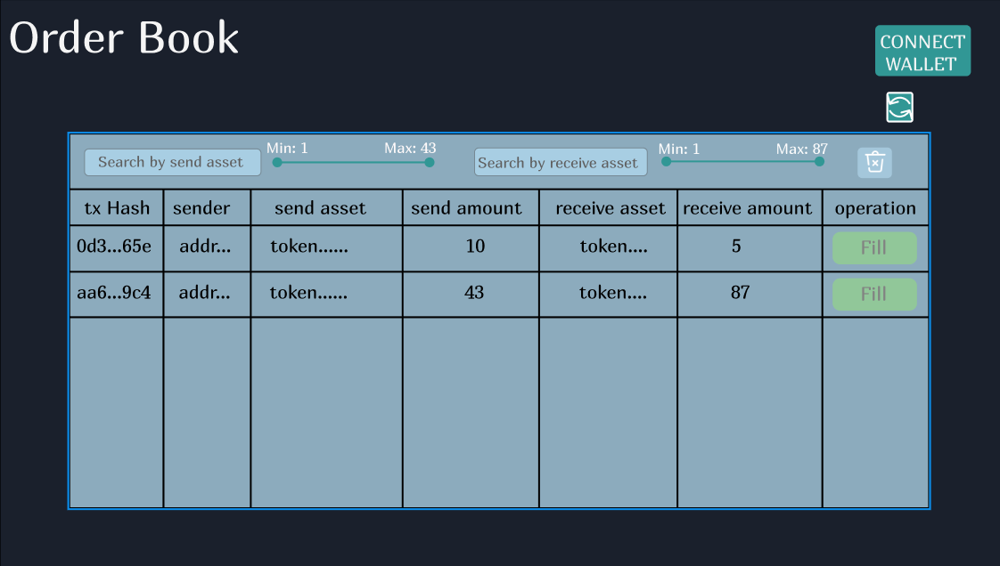

# Order Book dApp frontend design

In this document we share a quick mock-up for the UI/UX of the Order Book.
In this first version there is an initial home page screen that displays active orders and gives the user the option to connect their wallet to the dApp.

## Home page

## Connection pages

Once the user is connected to the dApp, they can either start new orders, or fill existing ones.

References:

- The **Start** button triggers a pop-up.
- Underlined texts are buttons that changes the page.
- \<address> is the user's address.

### Fill Orders

This is the home screen the user sees when they connect their wallet. Like in the disconnected home screen, they can see all the information relevant to the **active** orders. There is also a new column available which displays the option to fill the respective order, via a new button **fill**.
Users can also create new orders by clicking the **start** button.
By clicking the **Created Orders** text, the can acces the user's own orders page.

### User's own orders

In this page, all the information relevant to active orders that have the connected address as the sender address is displayed. The columns are the same as the fill order, but instead of having a **fill** button, there is a **cancel** button. By clicking it, the user can cancel the order, that is, erase it from the active orders, and getting their payment back.
The user can all the active orders by clicking the **Fill Orders** text.

### User history

Here the users can see the orders they were involved in. In the **operations** column they can check wether the order was cancelled by them or resolved by another user.

### Start an order

This is the pop-ip that displays when the connected user clicks on the **Start** button. Here they simply have to select the token they want to exchange, and how much of it; and what token and how many they want in return.
